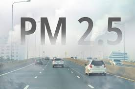

# Data Analysis Challenge: Impact of Weather Conditions on Air Quality
(2010–2014)

## Introduction
This purpose of this project is to assess the impact of weather conditions on air quality.

### What is air quality?

Air quality is a measure of how clean or polluted the air is. 

