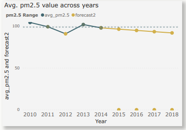

# Data Analysis Challenge: Impact of Weather Conditions on Air Quality
(2010–2014)


___
## Introduction
This purpose of this project is to assess the impact of weather conditions on air quality. 

### What is air quality?

Air quality is a measure of how clean or polluted the air is. 

### What is PM2.5?
Particulate matter 2.5 (PM2.5 ), refers to tiny particles or droplets in the air that are 2 1/2 microns or less in width. Like inches, meters and miles, a micron is a unit of measurement for distance. It is a mixture of solid and liquid particles that are suspended in the air. These are categorized into coarse, fine and ultrafine. These particles usually come from cars, trucks, buses and off-road vehicle (e.g., construction equipment, snowmobile, locomotive) exhausts, and other operations that involve the burning of fuels such as wood, heating oil or coal and natural sources such as forest and grass fires. 

## Statement Problem
1. What weather factors greatly influence the PM 2.5 value?
2. Which month and year recorded the highest and lowest PM 2.5 value?
3. What is the forecast projection of the pm2.5 value in the next 4 years?

## Skills/ Concepts Demonstrated
The following PowerBI features were incorporated into this project: 
- DAX,
- Bookmarking
- Drillthrough filtering

## Data Modelling
I created a one column dataset in excel containing the year values only. I also included the additional years I wanted to calculate pm2.5 values for (2015- 2018). I then uploaded it into my power query editor. It was linked automatically with the weather dataset using the year column.


___

## Data Preparation/Cleaning
The dataset contained 13 columns and 41,757 rows. The dataset can be found [here](https://archive.ics.uci.edu/ml/datasets/Beijing+PM2.5+Data)
I cleaned them as follows:
 
1. I deleted all null values
2.  I created a new measure "short_month" showing the name of the month.- I created this value from the month column provided in the dataset:
 
 ``` short_month = SWITCH('PRSA_data_2010 1 1-2014 12 31 (1)'[month],```
   ```1, "JAN", 2, "FEB", 3, "MAR", 4, "APR", 5, "MAY",6,"JUN",7, "JUL", 8,"AUG",9, "SEP",10, "OCT", 11, "NOV", 12, "DEC", BLANK())```
   
3. I changed the data type of the date column to date
4. I created a new measure "avg_pm2.5 " from the pm2.5 value :

``` avg_pm2.5 = AVERAGE('PRSA_data_2010 1 1–2014 12 31 (1)'[pm2.5])```

5. I created a new measure "CAGR" ( compound annual growth rate ) which calculated the annual growth rate of the
 pm2.5 value over a period of time (2010 -2014).

  ```
  CAGR = 
  VAR Lastyear = [Last year]
  VAR Firstyear  = [First year]
  VAR No_of_year = [Last year]-[First year]
  RETURN

  POWER(
  DIVIDE(
    CALCULATE([avg_pm2.5],Sheet1[Year] = Lastyear),
     CALCULATE([avg_pm2.5], Sheet1[Year] = Firstyear)  ), 1 /No_of_year) - 1 

```
6. I created another measure "forecast2" which calculated the forecast pm2.5 values for years greater than the
  "Last year" variable defined above.

  ```
  forecast2 = 
  VAR Lastyear = [Last year]
  VAR No_of_years = SELECTEDVALUE(Sheet1[Year]) - [Last year]

  RETURN
  IF(SELECTEDVALUE(Sheet1[Year]) >= Lastyear,
  CALCULATE([avg_pm2.5], Sheet1[Year] = Lastyear)
  * POWER((1 + [CAGR]), No_of_years) )
  ```

## Analysis 1 : What weather factors greatly influence the PM 2.5 value?

Weather factors greatly influencing the average PM 2.5 value include the hours of rainfall, hours of snow, hour of the day, combined wind direction, temperature and the Dew point. 

1. **Temperature**: The PM 2.5 value could also be seen to be negatively correlated with temperature. As the temperature increased, the PM 2.5 value decreased. This probably explains why its value is highest at midnight when the temperatures are usually lowest then it decreases in the afternoon when the temperature is around its peak. Temperature can also influence PM2.5 concentration through promoting the volatilization of ammonium nitrate and affect the emission rates from domestic heating and power production.


2. **Hours of snow fall**: The hours of snow fall were also found to significantly affect the PM 2.5 values. As the hours of snow fall increased, the PM 2.5 values decreased.


3. **Dew point**: The dew point is positively correlated with the average PM 2.5 values. As the dew point increased, so did the average PM 2.5 value except for a few cases of outliers. The highest PM 2.5 value was experienced at 0 ℃.


4. **Hours of rainfall**: The results showed that the PM 2.5 value has a negative correlation with rainfall. The higher the hours of rainfall, the lower the concentration of PM 2.5. The PM 2.5 value was at its highest when there was no rainfall and its value decreased as the hours of rainfall increased.


5. **Hours of the day**: I also created a line chart to analyze the relationship between the average pm2.5 value and the hour of the day. The PM 2.5 recorded its highest average value 112.47 ug/m³ around midnight and gradually declined thereafter. It recorded its lowest value 86.34 ug/m³ around 3pm and steadily increased thereafter.


6. **Combined wind direction**: When analyzing the relationship between the combined wind direction and the average pm2.5 value , I discovered that the effect of wind direction was found to be negatively correlated with the PM 2.5 values. The PM 2.5 values were typically highest with predominantly south winds; days with calm/variable winds generally produced higher concentrations than did those with predominantly north winds.


## Analysis 2: Which month and year recorded the highest and lowest PM 2.5 value?

I used a line chart to create a trend analysis to analyze the pm2.5 values over across the years and months. I discovered that in February, the average PM 2.5 value recorded its highest value while its lowest value was recorded in August. In Jan 2013, the average PM 2.5 recorded its highest value of 193.27 ug/m³ while it recorded its lowest value in Jan 2011 with 44.89 ug/m³ across the years. The year 2010 recorded the highest values so far while 2012 had the least values.


## Analysis 3: What is your forecast projection of the average pm2.5 value in the next 4 years?

I discovered that after 2014, the PM 2.5 value values will most likely decrease from 97.80ug/m³ in 2014 to about 91.76ug/m³ in 2018. I used a line chart to show my projections of the average pm2.5 value over the next 4 years as shown below:




## Visualizations

The final report consists of 4 interactive pages: home, weather factor, time series analysis, and drill through page as seen below:


## Recommendations
1. Government should develop policies and set up agencies to monitor and regulate PM 2.5 values. A standard limit should be set and maintained.
2. Government should embark on sensitizing the members of the public on some activities that increase the PM 2.5 values in the environment e.g. Wild fires, bush burning, burning of gas in motorized vehicles, industrial processes, power generators, stoves, fire places, smoking tobacco etc. These practices should be discouraged.
3. Government can offer subsidies to companies producing electric cars to reduce cost and increase purchase while increasing tax on companies still producing gas or diesel cars, machines.
4. During the cold season, Government can offer subsidies on electricity to encourage the use of electric heaters and discourage its citizens from using gas or burning wood to keep themselves warm.
5. Residents should reduce time spent outdoors during periods with high pollution.


